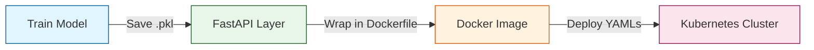
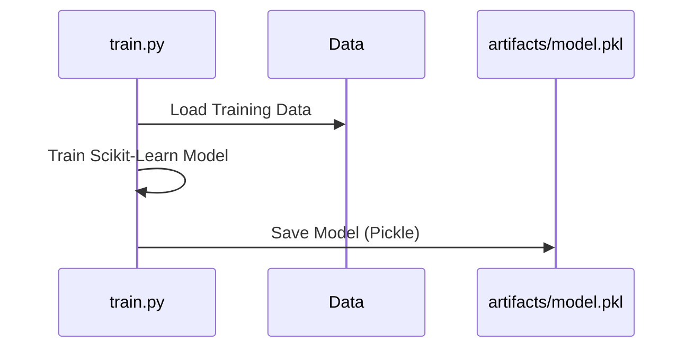

# 🚀 ML API with FastAPI, Docker, and Kubernetes

This project demonstrates how to build, containerize, and orchestrate a Machine Learning API. It takes a model from training all the way to a scalable production deployment.

### 📌 Core Technologies
* **FastAPI** (API routing and validation layer)
* **Scikit-learn** (Machine Learning model training & prediction)
* **Docker** (Environment containerization)
* **Kubernetes (Minikube)** (Deployment and orchestration)

---

## 🔄 High-Level MLOps Workflow


---

## 📁 Project Structure

```text
ml-api-k8s/
├── src/
│   ├── api/
│   │   ├── main.py        # FastAPI app initialization
│   │   └── routes.py      # API endpoints (GET, POST)
│   ├── model/
│   │   ├── train.py       # Model training logic
│   │   ├── predict.py     # Prediction/Inference logic
│   │   └── utils.py       # Helper functions
├── artifacts/
│   └── model.pkl          # Saved trained model
├── tests/
│   ├── test_prediction.py # Unit tests for prediction logic
│   ├── test_api.py        # Unit tests for API logic
│   ├── test_full_pipeline.py # E2E tests for full pipeline
│   └── test_scalability.py    # E2E tests for scalability
├── config/
│   ├── config.yaml        # Configuration files
│   └── input_schema.yaml    # Input schema configuration   
|
├── k8s/
│   ├── deployment.yaml    # Kubernetes deployment config
│   └── service.yaml       # Kubernetes service config
├── Dockerfile             # Container recipe
├── requirements.txt       # Python dependencies
└── README.md
```

---

## ⚙️ Step-by-Step Implementation Guide

### STEP 1: Train the Model (`src/model/train.py`)
First, we must train the machine learning model and save it as a reusable artifact.


**What this achieves:**
✔ Creates the ML model
✔ Saves it as a deployment-ready artifact (`model.pkl`)

---

### STEP 2: Build and Test the API Locally
We wrap the model in a FastAPI application so users can communicate with it over HTTP.

**1. Create necessary folders:**
```bash
mkdir -p src/api src/model artifacts
```
**2. Install Dependencies:**
```bash
pip install fastapi uvicorn numpy scikit-learn
- ALWAYS install them inside a virtual environment using venv and activate it

```
**3. Run the API Locally:**
```bash
uvicorn src.api.main:app --reload
```
**4. Test via Swagger UI:**
* Open your browser and go to: `http://localhost:8000/docs`
* Test the `/predict` endpoint using a sample payload: `[5.1, 3.5, 1.4, 0.2]`

#### 🔄 The API Prediction Flow
```mermaid
graph TD
    User((User)) -->|POST /predict<br/>[5.1, 3.5, 1.4, 0.2]| Route[FastAPI<br/>src/api/routes.py]
    Route -->|Pass Data| PredictLogic[src/model/predict.py]
    PredictLogic -->|Load & Run| PKL[(artifacts/model.pkl)]
    PKL -->|Result| PredictLogic
    PredictLogic -->|Return Dict| Route
    Route -->|HTTP 200 OK| User
```

---

### STEP 3: Dockerize the API (Containerization)
Turn the local API into a portable, deployable unit that runs identically on any machine.

**1. Build the Docker Image:**
```bash
docker build -t ml-api .
```
**2. Run the Container Locally:**
```bash
docker run -p 8000:8000 ml-api
```
*(You can now test it again at `http://localhost:8000/docs` to verify the container works).*

---

### STEP 4: Deploy to Kubernetes
Scale the containerized API using Kubernetes orchestration.

**1. Start your local cluster:**
```bash
minikube start
```
**2. Build the image inside Minikube's environment:**
*(This ensures Minikube has access to your locally built image)*
```bash
eval $(minikube docker-env)
docker build -t ml-api .
```
**3. Apply the Kubernetes Configurations:**
```bash
kubectl apply -f k8s/deployment.yaml
kubectl apply -f k8s/service.yaml
```
**4. Access the Live API:**
```bash
minikube service ml-api-service
```

---

## 🚀 Future Improvements
* [ ] Add **MLflow** for experiment tracking and model registry.
* [ ] Add a **CI/CD pipeline** (GitHub Actions) for automated testing and deployment.
* [ ] Add **Monitoring** (Prometheus + Grafana) to track API latency and Data Drift.
* [ ] Implement strict **Model Versioning**.

---

## 🔥 Final Tips & Best Practices
* Keep your `.gitignore` strict to avoid accidentally pushing large model binaries (`.pkl`, `.h5`) to GitHub.
* Keep your `.dockerignore` lean to ensure faster Docker image builds.
* Always separate `main.py` and `routes.py` to maintain a clean codebase as your API scales.

---

👨‍💻 **Author:** Moh Rafik | [Profile](http://www.mohrafik.it)
